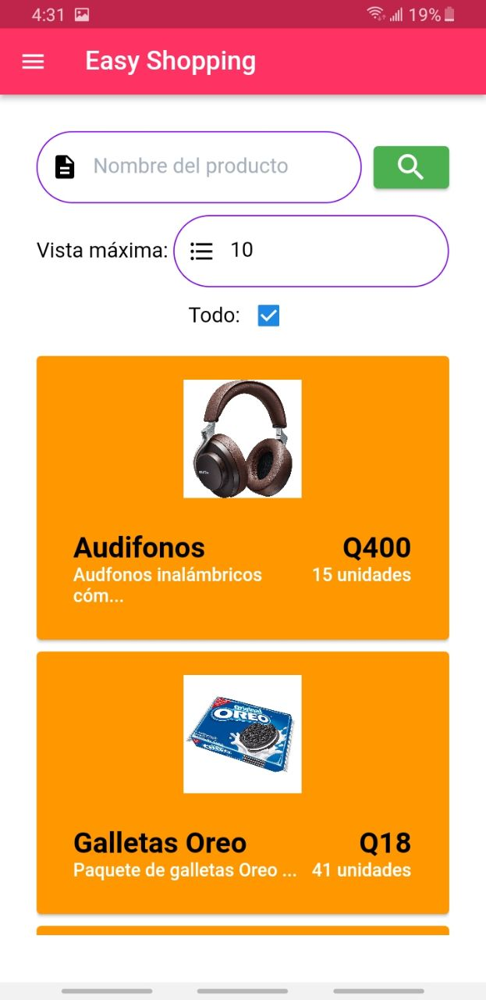

# **Easy Shopping**
Aplicación móvil desarrollada en Flutter la cual consiste en que los usuarios pueden comprar productos o adquirir servicios de tiendas cercanas o asociadas a su colonia o el lugar donde viven. También, dueños de tiendas pueden tener su propio rol dentro de la aplicación, el cual les permite agregar información de su tienda, agregar y actualizar sus productos y ver el registro de sus ventas.

El almacenamiento de la información así como de imágenes se realizó usando Firestore y Storage de Firebase. Para la autenticación de los usuarios, se usó la Autenticación por Google, también por medio de Firebase.

La extracción de la información por medio de NoSQL permite a la aplicación el análisis y el despliegue de la información del usuario, tiendas y productos cercanos, compras realizadas, etc. según el usuario y su lugar de residencia.

## Tecnologías y conocimientos empleados
- Flutter
- Firebase
- Base de datos no relacional (Firebase Firestore)
- Almacenamiento de Firebase (Firebase Storage)
- Google Authentication
- NoSQL

## Capturas de pantalla importantes de la aplicación

#### On Board

#### Autenticación por Google

#### Menú Principal de cliente

#### Side Bar

#### Tiendas y productos

#### Compra de productos

#### Menú y funciones de dueño de tienda

#### Ventas

